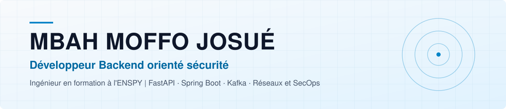

<picture>
  <source media="(prefers-color-scheme: dark)" srcset="assets/banner-dark.svg"/>
  
</picture>

## À propos

Élève ingénieur en 5e année de génie informatique à l'École Nationale Supérieure Polytechnique de Yaoundé (ENSPY), basé à Yaoundé, Cameroun.

Mon profil se situe à l'intersection du développement backend et de la sécurité réseau. Je conçois des APIs et des architectures distribuées tout en gardant un œil sur les surfaces d'attaque : chiffrement AES et RSA, microservices événementiels sur Kafka, plateforme SaaS multi-tenant. J'aime comprendre un système de bout en bout, de la ligne de code jusqu'au paquet réseau, et le faire tenir en production sous charge réelle.

Disponible pour des stages et des missions ponctuelles, y compris à distance : backend, API REST, architecture microservices, sécurisation d'applications.

## Domaines d'intervention

| Backend et APIs | Architecture distribuée | Sécurité | Réseaux et systèmes |
|:--|:--|:--|:--|
| Python, Java, REST | Microservices, Kafka, multi-tenancy | OWASP Top 10, AES/RSA, analyse de vulnérabilités | Linux, SNMP, Nagios, Wireshark |

## Stack technique

<strong>Langages</strong> 

<strong>Frameworks</strong> 

<strong>Architecture et données</strong> 

<strong>Infrastructure et réseaux</strong> 

## Projets

| Projet | Description | Stack | Liens |
|:--|:--|:--|:--|
| **Shuba** | Marketplace e-commerce SaaS multi-tenant avec isolation des bases de données par boutique. En production. | Django, PostgreSQL, Celery, Redis, Docker | [Application](https://shuba.onrender.com/) |
| **TravYotei** | Portail de réservation de trajets interurbains avec état des bus synchronisé en temps réel. En production. | Next.js, TypeScript, WebSockets | [Application](https://frontend-travyotei.vercel.app/) |
| **API-Rsv-TravYotei** | Moteur distribué de traitement des réservations à haut débit, en architecture événementielle avec traitement idempotent des messages. En cours. | Spring Boot, Kafka, PostgreSQL, Docker | [Dépôt](https://github.com/JosueMoffo/API-Rsv-TravYotei) |
| **Système de recommandation** | API REST de suggestion d'ouvrages par filtrage collaboratif, visant des temps de réponse sous 100 ms. En cours. | Flask, Scikit-Learn, Pandas | [Démo](https://recommendation.up.railway.app/) |
| **QUORX: System Instinct** | Jeu éducatif de simulation système (processus, mémoire, réseau, sécurité) pour développer les réflexes en ingénierie informatique. En cours. | Godot 4, GDScript, SQLite | [Dépôt](https://github.com/JosueMoffo/Quorx) |

## Activité GitHub

<picture>
  <source media="(prefers-color-scheme: dark)" srcset="https://github-readme-stats.vercel.app/api?username=JosueMoffo&hide_border=true&bg_color=00000000&title_color=e2e8f0&text_color=94a3b8&icon_color=38bdf8&show_icons=true"/>
  
</picture>
<picture>
  <source media="(prefers-color-scheme: dark)" srcset="https://github-readme-stats.vercel.app/api/top-langs/?username=JosueMoffo&hide_border=true&bg_color=00000000&title_color=e2e8f0&text_color=94a3b8&icon_color=38bdf8&layout=compact&langs_count=6"/>
  
</picture>

## Objectifs

- Approfondir la sécurité offensive par la pratique du test d'intrusion
- Obtenir les certifications Cisco CCNA et CompTIA Security+
- Continuer à renforcer l'analyse de vulnérabilités et l'administration sécurisée des infrastructures

## Contact

Email : [josuemoffo@gmail.com](mailto:josuemoffo@gmail.com) | LinkedIn : [josue-mbah-moffo](https://www.linkedin.com/in/josue-mbah-moffo/) | Portfolio : [josuembah.ag-technologies.tech](https://josuembah.ag-technologies.tech/)
